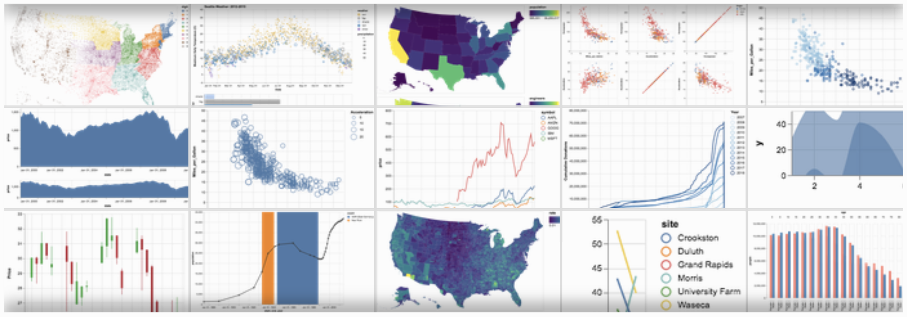

# Exploratory Data Visualization with Altair

Welcome! Here you will find the source material for the Altair tutorial, given at PyCon 2018. 

An overview of the content can be found at [notebooks/Index.ipynb](notebooks/Index.ipynb)

The intro slides on are on [SpeakerDeck](https://speakerdeck.com/jakevdp/altair-tutorial-intro-pycon-2018)

The workshop was recorded and is available [on YouTube](https://www.youtube.com/watch?v=ms29ZPUKxbU)

This tutorial has been made into a jupyter book and is hosted at https://altair-viz.github.io/altair-tutorial

See the Altair documentation at http://altair-viz.github.io/

## Run the Tutorial

If you have a Google/Gmail account, you can Run this tutorial from your browser using Colab: [Open in Colab](https://colab.research.google.com/github/altair-viz/altair-tutorial/blob/master/notebooks/Index.ipynb).

Also you can run in Binder: 
